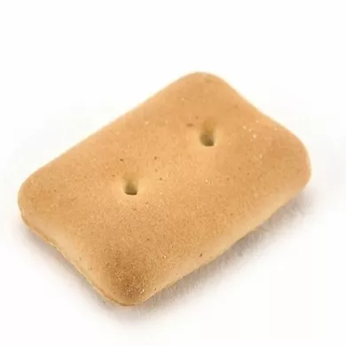

# Hello! :D

## yswysw
- I'm a normal student developer that was born in 2008, and known as yswysw in [Discord](https://discord.com/users/745848200195473490), [Blog](https://blog.naver.com/lswja6866), and [Scratch](https://scratch.mit.edu/yswysw), etc.
- I usually do `python`, but sometimes `HTML` *only*. This is because I never do good in WEB like `JS`, `CSS`, etc. And I'm not good at design, too.
- I'm in [Studio Orora](https://github.com/teamorora), made by [me](https://github.com/sw08), and in [Team Teb](https://github.com/TEAMTEB), made by [OHvrything](https://github.com/OHvrything). 

#### My Top Language

<!--
**sw08/sw08** is a ✨ _special_ ✨ repository because its `README.md` (this file) appears on your GitHub profile.

Here are some ideas to get you started:

- 🔭 I’m currently working on ...
- 🌱 I’m currently learning ...
- 👯 I’m looking to collaborate on ...
- 🤔 I’m looking for help with ...
- 💬 Ask me about ...
- 📫 How to reach me: ...
- 😄 Pronouns: ...
- ⚡ Fun fact: ...
-->
